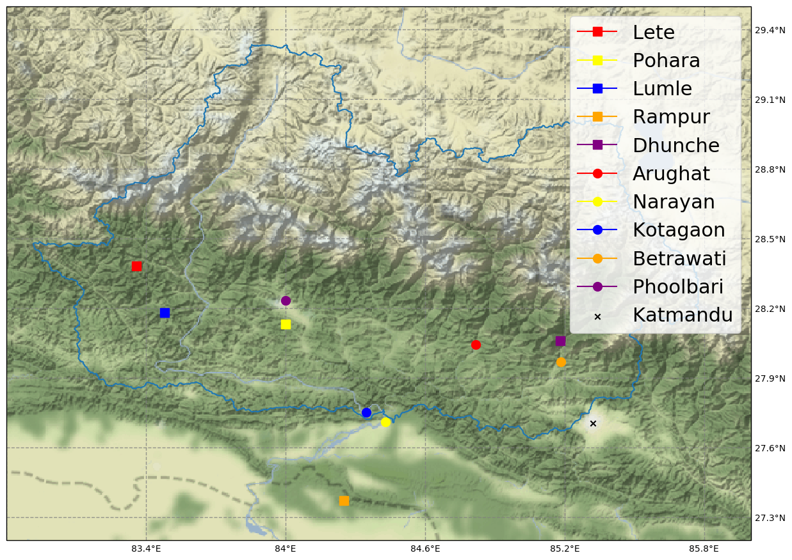
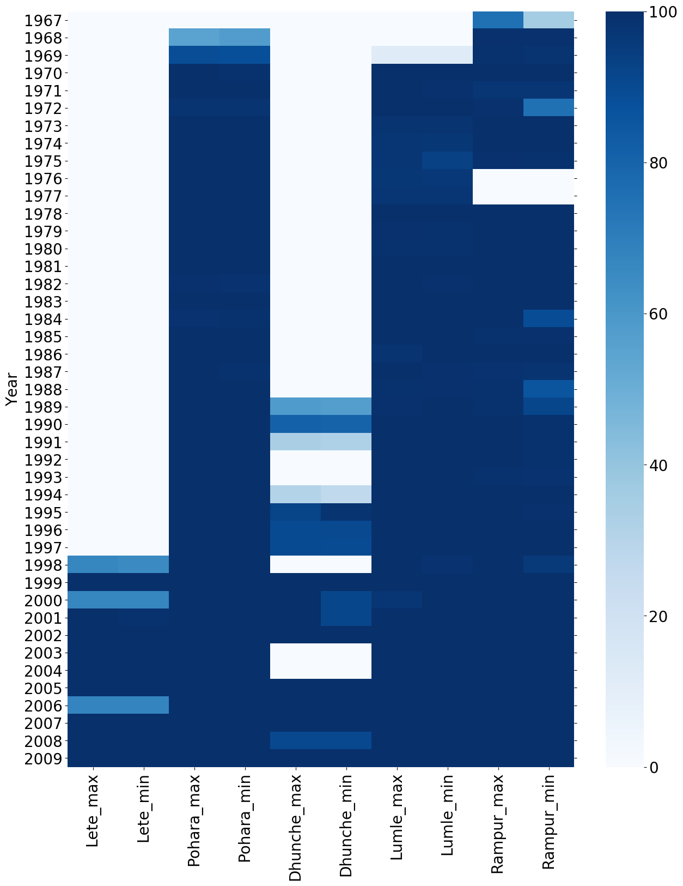

# Group project in GEO4300 fall 2019.

This project converts hydrological and meteorological datasets from stations located in the Narayani basin in Nepal to a format easily readable by pandas.
It also contains functions for plotting timeseries
and the stations location inside the basin.

Datasets can be requested from [Department of Hydrology and Meteorology](http://dhm.gov.np/).

## Converting dataset to time series

Edit src/common.py to set input and output folders.

Run src/convert.py to convert discharge, precipitation and temperature
files to timeseries and store the output as csv files that are easily readable
with pandas.

src/test_hyd.py runs some consistency checks on the discharge datasets
to see if calculating monthly minimum, maximum and mean values match the
provided values. For the test to pass for all the files we had available the
accepted relative tolerance was set to 0.01. This might be due to missing data.

## Dataset description

The quality of the datasets are varied. There are a lot of missing
values and it is useful to use run src/plot.py after conversion to
generate coverage plots. The color scale corresponds to coverage in percents.

### Discharge data

Discharge data consists of daily totals and monthly minimum, mean and maximum values.
The location information for each discharge station is on the format
27 45 00, which we assume to be sexagesimal degrees. We converted this
data to decimal degrees with the formula $$ \text{decimal degrees} = \text{deegres} + \frac{\text{minutes}}{60}
+ \frac{\text{seconds}}{3600}$$

### Temperature and precipitation

Datasets contain daily minimum and maximum temperature and total daily
precipitation. Entries with values of DNA or -99.9 is assumed to mean missing value and will be replaced with NaN by the conversion scripts.
Some of the precipitation files contains values of T. This corresponds
to 0.2 or less. These
values are replaced with 0.2.

Coordinate format:
28.38 83.36

Assume this corresponds to decimal degrees, with first value latitude, second value longitude.
